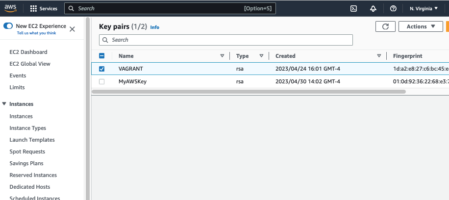
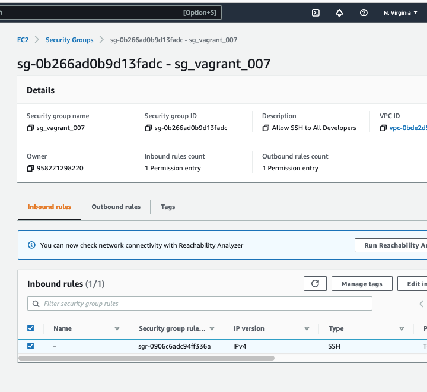
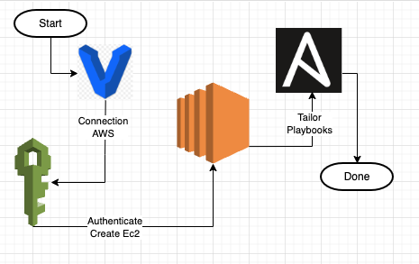
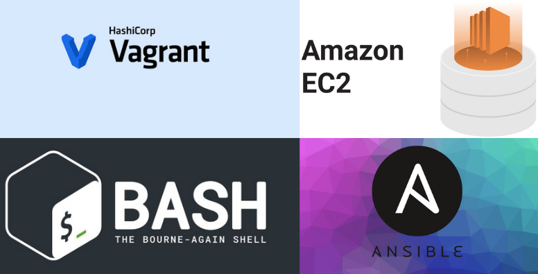

# Vagrant CI Project 

Project Requirement  
Using Ansible; setup a Continuous Integration server of your choosing on a Vagrant Box. You are not required to setup Vagrant or its requirements on the host machine.

Here is what is completed 
- setup Vagrant configuration for deployment of an EC2
- setup Credentials and Security Group on AWS
- Using Vagrant 
1. configured an Ansible Job
2. able to tailor target(s) with playbooks
3. able to manage the server with Vagrant

How to Test 
1. setup with credentials
- Get <keyname>.pem "Key Pair" from the AWS EC2 Console   
2. git clone repo 
3. vagrant plugin install vagrant-env 
4. login to AWS console 
    - in EC2 Console create security group
    - export "these vars" 
    - create key pair of named credentials 
    - 
5. Must have a keypair and the name must match the Vagrantfile 

 
6. Must have a security group and the name must match the Vagrantfile  

    
    

7. Here is the basic flow 

<pre>
# take the pem key and put it in a location 
# get the keys and export them
export AWS_ACCESS_KEY_ID=123456keyname
export AWS_SECRET_ACCESS_KEY=xyz123pdq
export AWS_SSH_PVT_KEY=/home/<myfolder>/.ssh/VAGRANT.pem

git clone /vagrant-ansible-aws-ec2
cd vagrant-ansible-aws-ec2 /
sudo apt install vagrant 
vagrant init
vagrant plugin install vagrant-aws
vagrant plugin install vagrant-env 
vagrant up --provider=aws
vagrant global-status
vagrant status 
vagrant status -full
vagrant destroy -g -f
vagrant plugin list
vagrant halt
</pre>

## Products included here

